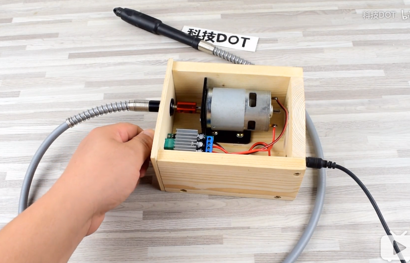
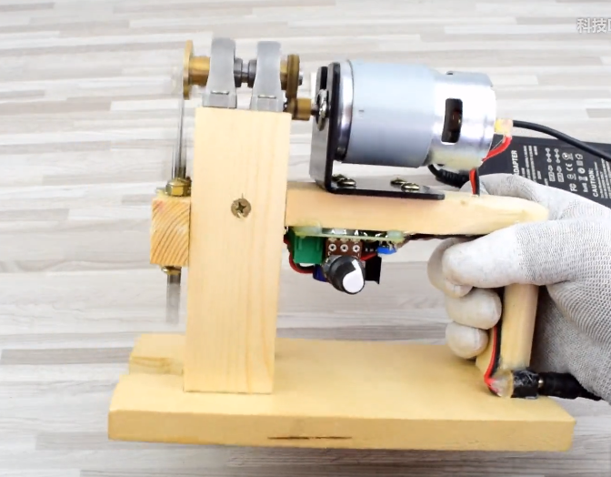
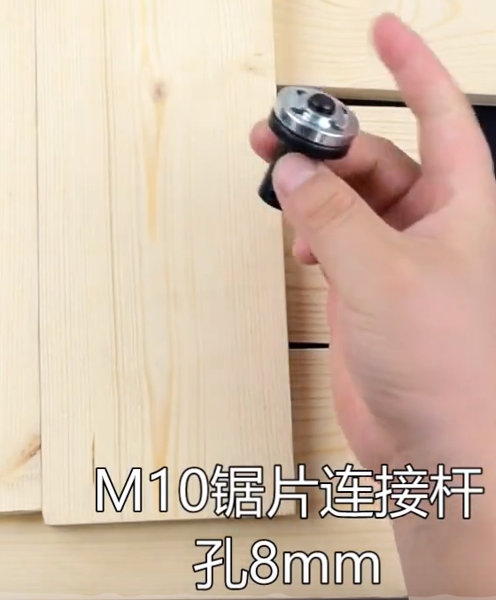
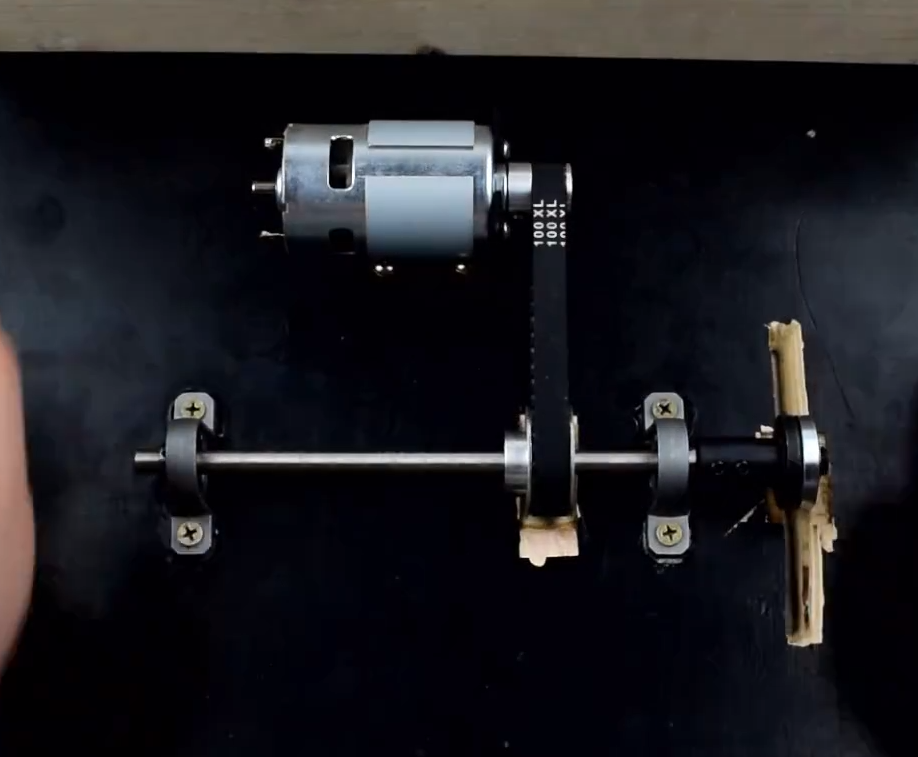

- [木工](#%e6%9c%a8%e5%b7%a5)
  - [成品制作流程](#%e6%88%90%e5%93%81%e5%88%b6%e4%bd%9c%e6%b5%81%e7%a8%8b)
  - [榫卯结构](#%e6%a6%ab%e5%8d%af%e7%bb%93%e6%9e%84)
  - [工具类](#%e5%b7%a5%e5%85%b7%e7%b1%bb)
  - [板材认识](#%e6%9d%bf%e6%9d%90%e8%ae%a4%e8%af%86)
  - [自制手电转 制](#%e8%87%aa%e5%88%b6%e6%89%8b%e7%94%b5%e8%bd%ac-%e5%88%b6)
  - [万向轴雕刻机 制](#%e4%b8%87%e5%90%91%e8%bd%b4%e9%9b%95%e5%88%bb%e6%9c%ba-%e5%88%b6)
  - [手持电动条锯 改](#%e6%89%8b%e6%8c%81%e7%94%b5%e5%8a%a8%e6%9d%a1%e9%94%af-%e6%94%b9)
  - [曲线锯 制](#%e6%9b%b2%e7%ba%bf%e9%94%af-%e5%88%b6)
  - [自制台切割机](#%e8%87%aa%e5%88%b6%e5%8f%b0%e5%88%87%e5%89%b2%e6%9c%ba)
  - [切割台 制](#%e5%88%87%e5%89%b2%e5%8f%b0-%e5%88%b6)
  
# 木工
## 成品制作流程
1. 成型木坯
1. 亚麻油 linseed old
2. 涂蜡

## 榫卯结构
+ 燕尾榫
  + 箱子
   

## 工具类
+ 3.13联轴器
  + 用于主轴带动副轴 副轴可固定位置  主轴发生变化而不影响副轴运动
+ 砂带机
+ 车床
+ 线锯机
+ 牙机 打磨用
  + sae shin
+ 拉花锯
+ 台钳
+ 黄金锉、杂锦锉
+ 砂纸
  + 目数 80、240、400、600、800、1000、1200、1500、2000
+ 文玩抛光块
  + 美甲用的那种
+ 木蜡油
  + 防止木头开裂
+ 直切式圆锯机、导轨板
+ 伞齿轮 并联多个电机
+ 皮革木材 401胶水
+ 滑动轴承

## 板材认识
+ 木芯板
  + 两薄片夹一厚芯
+ 三夹板
  + 多个薄片组合、类似千层蛋糕
+ 薄片三夹板
  + 很薄、厚度一般1-8公分
+ 常见规格
  + 三六板材
    + 规格 92cm * 183cm
  + 四八板材
    + 规格 120cm * 244cm

## 自制手电转 制
+ 传动
  + 555马达 5mm
  + JTO钻头夹轴套 内径 3.17
  + JTO钻头夹
+ 电
  + 5.5DC插座
  + 钮子开关
  + 无锁按键开关
+ 耗材
+ 其他
  + 扩孔器
+ 步骤
  + JTO钻头夹轴套 套进 JTO钻头夹 再串接555马达 锁定
+ 参考
  + https://www.bilibili.com/video/BV12W411G7fc

## 万向轴雕刻机 制
+ 轴承
   + 3.17mm-5mm 联轴器
+ 马达
  + 775马达固定座
  + 775马达 5mm
+ 木板
  + 35mmX70mmX13mm*2,135mmX92mmX13mm,118mmX75mmX5mm,118mmX135mmX5mm,95mmX57mmX13mm
+ 耗材
  + 电磨软轴
+ 电路
  + PWM 10A调速器
  + DC5.5插座
  + 12-24V5-10A电源适配器
+ 参考
  + https://www.bilibili.com/video/BV1WW41127wU/?spm_id_from=333.788.videocard.1
  + 

## 手持电动条锯 改
+ 参考
  + https://www.bilibili.com/video/BV1Gb41177o9/?spm_id_from=333.788.videocard.0

## 曲线锯 制
+ 轴承
  + M10锯片连接杆
    + 孔 8mm
    + 用于安装锯片
  + 钢轴 （用于连接 M10锯片连接杆、轴承座）
    + 长度 50mm
    + 直径 8mm
  + 轴承座 * 2（凸出部分向外安装）
    + 内径 8mm
  + 金属同步齿轮
    + 35齿 内径8mm （串接在轴承座之间的钢轴）
    + 15齿 内径5mm （用于连接马达头部）
  + 法兰联轴器内径 8mm
+ 马达
  + 775马达固定座
  + 775马达 5mm
+ 耗材
  + 曲线锯锯条
+ 其他
  + 铁片 孔距35mm 两8mm孔可能
  + 方孔金属片
  + 方形铁棍
  + 704硅橡胶（粘贴调速器电路板到木板上）
+ 电
  + 10A马达调速器 ne555调速器
+ 步骤
  + 8mm
    1. 钢轴连接联轴器锁定后   
    2. 串接上两个轴承座（凸出部位向外）锁紧
    3. 串接35齿金属齿轮 锁紧
  + 5mm 
    1. 775马达连接15齿金属齿轮 锁紧
+ 参考
  + https://www.bilibili.com/video/BV19W411i7kN?t=21
  + 

## 自制台切割机
+ 传动
  + 775马达固定座
  + 775马达 5mm
  + XL同步轮
      + 20齿 * 1 孔内径 8mm （串接在轴承座之间的钢轴）
      + 10齿 * 1 孔内径 5mm （用于连接马达头部）
  + 100XL同步带
+ 轴承
  + M10锯片连接杆 内径 8mm （用于安装锯片
  + 钢轴 200mm * 8mm  （用于连接 M10锯片连接杆、轴承座）
  + 轴承座 * 2 孔内径 8mm （凸出部分向外安装）
+ 耗材
  + 4寸40齿锯片
+ 电
  + DC5.5插座
  + 船形开关
+ 板材
  + 450mmX310mmX17mm，370mmX95mmX13mm，260mmX95mmX13m，250mmX95mmX13mm，234mmX95mmX13mm*2
+ 参考
  + https://www.bilibili.com/video/BV1UW411T7Jn?t=527

## 切割台 制
+ 动能
  + 555马达
  + 555马达支架
  + GT2同步带 98mm
  + GT2同步轮
    + 30齿 孔内径 5mm
    + 16齿 孔内径 3.17
+ 轴承
  + 法兰轴承 F688ZZ *2
  + 钢轴 110mm * 5mm
  + 5-5mm联轴器 （用于连接锯片 需要攻丝）
+ 耗材
  + 电摩金刚砂 切割片60mm孔6
  + 电磨锯片 60mm孔6
+ 电
  + PMW调速器
  + DC插座
+ 参考
+ https://www.bilibili.com/video/BV1jE411R7hf?t=335

