| 时间       | 事件                                                        | 备注                                         | 图片                  |
| ---------- | ----------------------------------------------------------- | -------------------------------------------- | --------------------- |
| 2001年10月 | 索尼和爱立信共同成立了索尼爱立信,各占50%的股份              |
| 2008年     | 发布了第一款 Xperia 手机 与微软合作搭载上Windows Mobile系统 |
| 2008.11    | Xperia™   、X1                                              | 游戏机外形                                   |   |
| 2009.10    | Xperia™ X2                                                  | 高通MSM7600、Window mobile 6.5               | 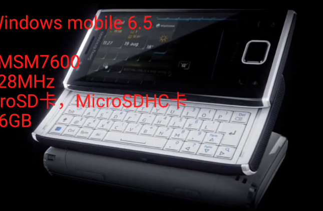      |
| 2009.11    | Xperia™ Pureness、索尼 X5、爱立信 Pureness                  |                                              | 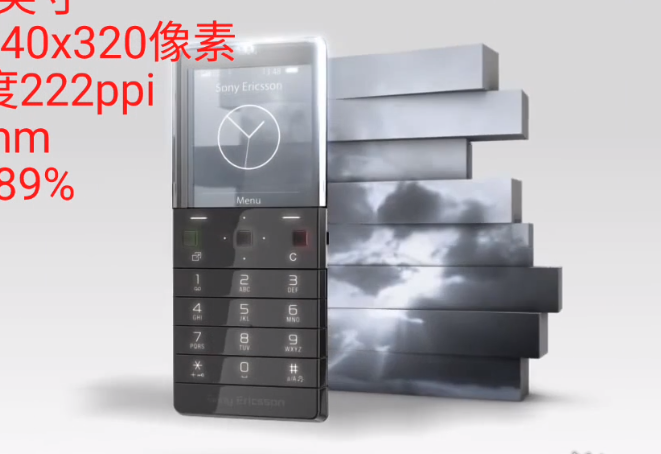       |
| 2010       | Xperia™ X10                                                 | 高通 QSD8250、第一款搭载安卓系统 安卓 2.2    | 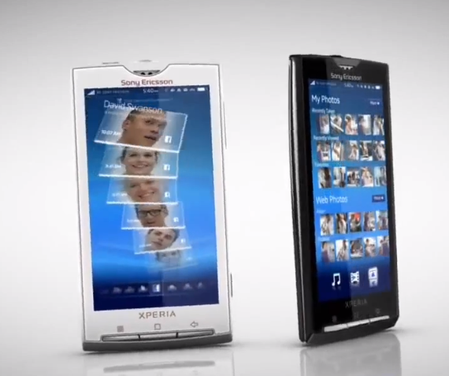     |
| 2010.9     | Xperia™ X8                                                  | 高通 MSM7227                                 | 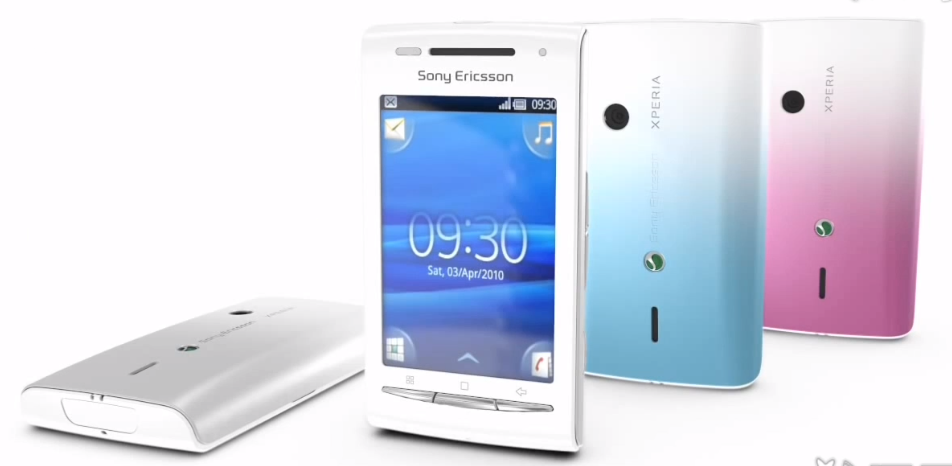      |
| 2010.11    | Xperia™ X10 mini、mini pro                                  | 高通 MSM7227                                 | 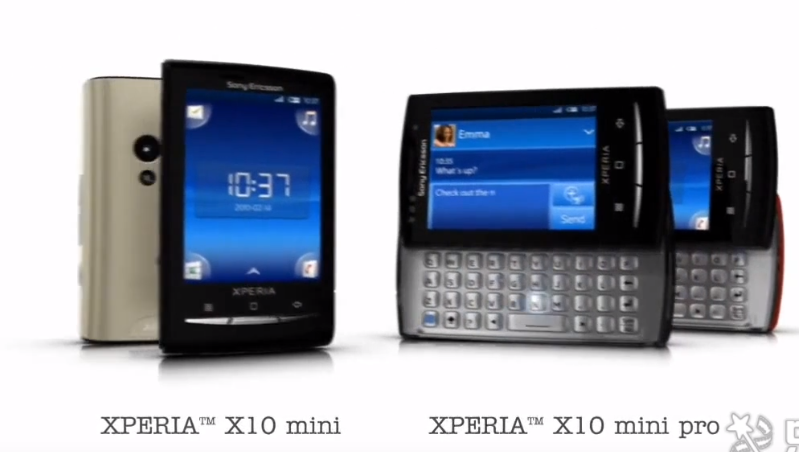 |
| 2016       | Xperia X                                                    |                                              |
| 2016.2     | Xperia X Performance                                        | 高通820、机身黑 白按键                       |
| 2016.2     | Xperia XA                                                   | 联发科 MT6755                                | 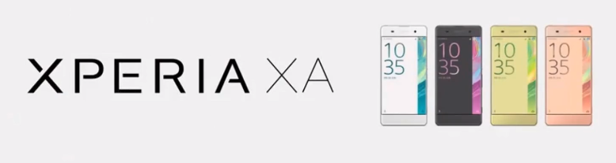       |
| 2016.4     | Xperia X Compact                                            | 高通650                                      |
| 2016.9     | Xperia XZ                                                   | 高通820                                      | 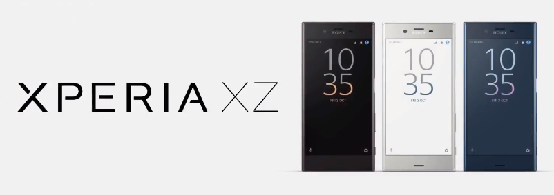       |
| 2017.2     | Xperia XZs                                                  | 高通820                                      | 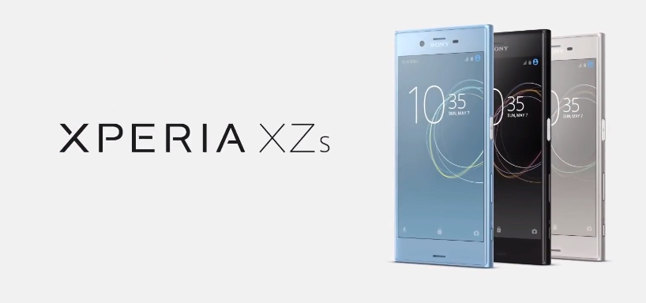      |
| 2017.4     | Xperia XA1                                                  | 联发科Hello H20                              | 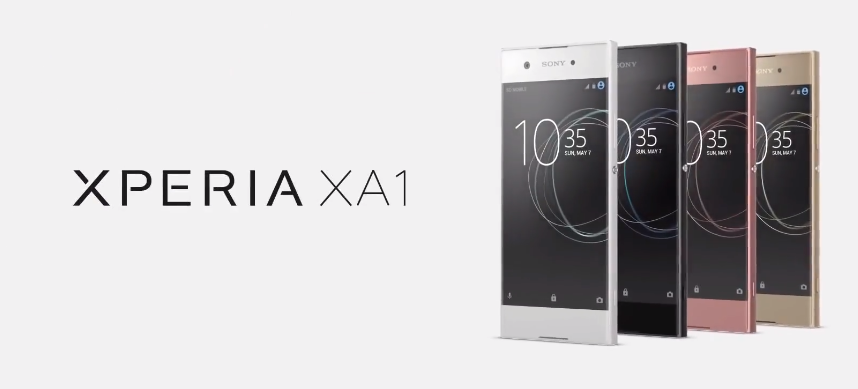      |
| 2017.6     | Xperia XZ Premium                                           | 高通835 、防水                               | 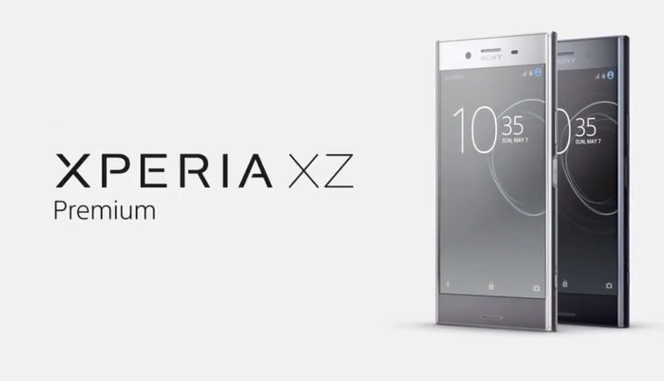      |
| 2017.10    | Xperia XZ1                                                  | 高通835 、防水、3D扫描、快照、慢速           | 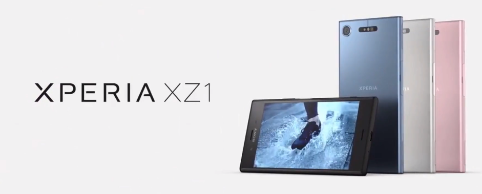      |
| 2017       | Xperia XZ1 Compact                                          | 高通835 、防水、120°广度角、960fps慢录、预拍 | 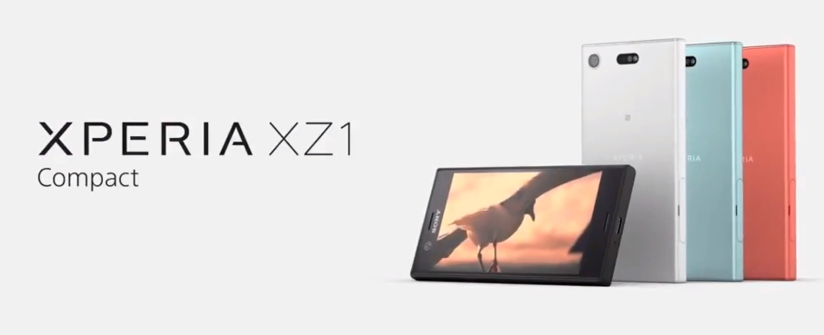     |
| 2018       | Xperia XA2                                                  | 高通630                                      | 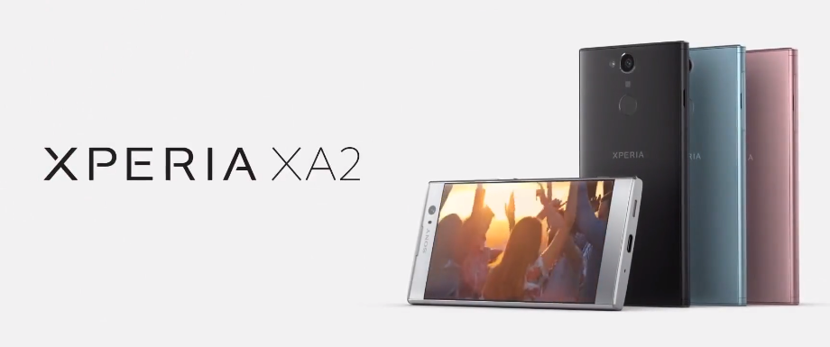      |
| 2018.4     | Xperia XZ2                                                  | 高通845                                      | 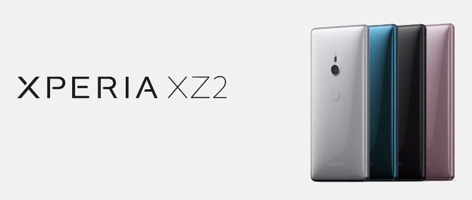      |
| 2018       | Xperia XZ2 Premium                                          | 高通845                                      | 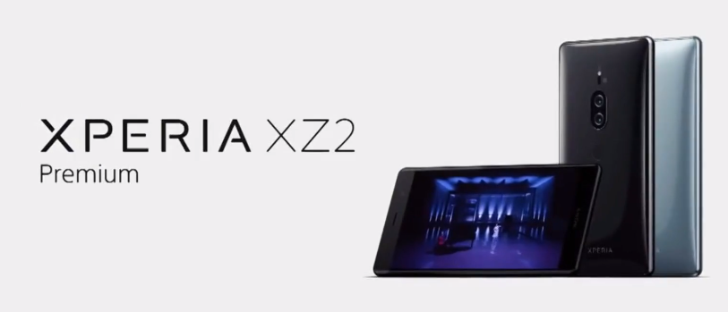     |
| 2018.4     | Xperia XZ2 Compact                                          | 高通845、炫酷、3D扫描                        | 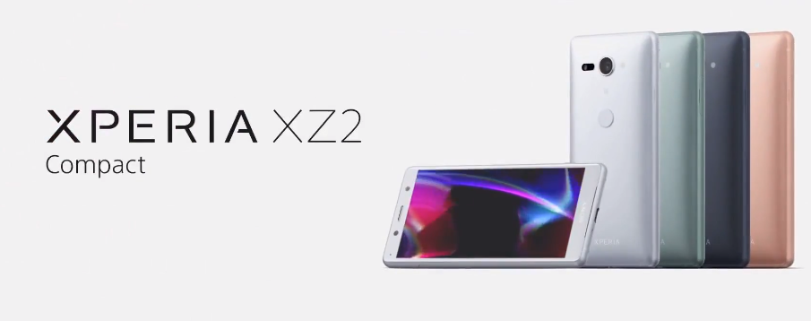     |
| 2018.10    | Xperia XZ3                                                  | 高通845、快动作舞蹈                          | 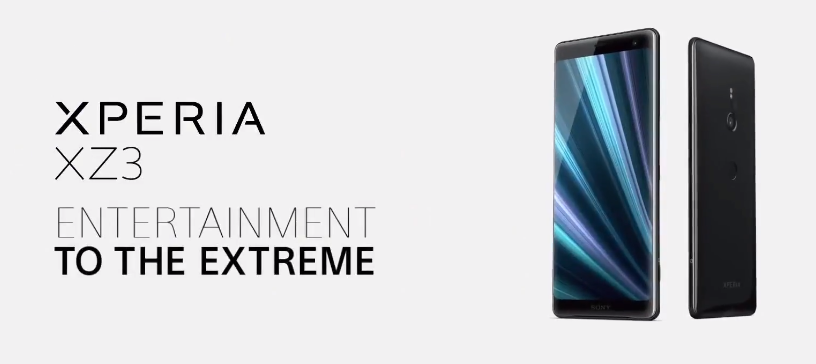      |
| 2019.4     | Xperia 10/10Plus                                            | 高通636                                      | 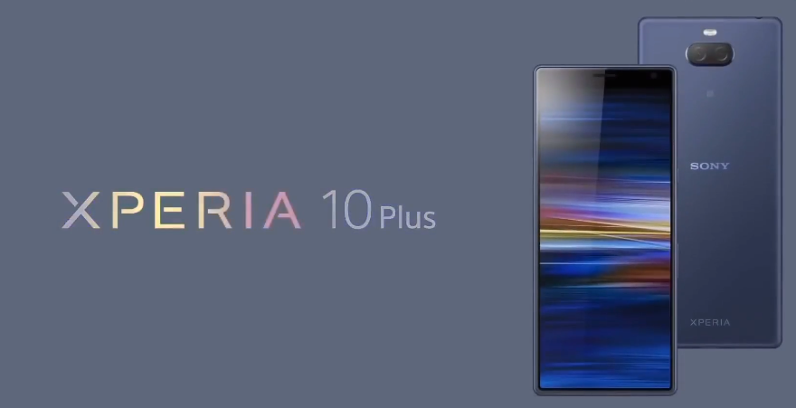   |
| 2019.5     | Xperia 1                                                    | 高通855                                      | 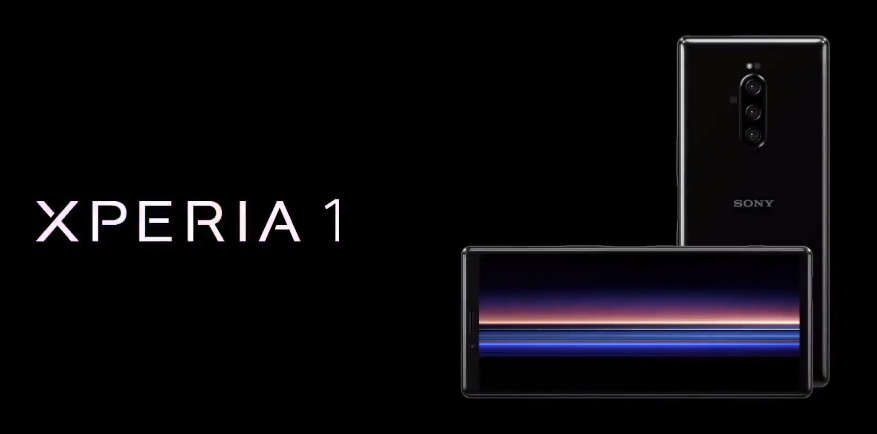        |

| 刷机步骤 | 工具             | 备注                   |
| -------- | ---------------- | ---------------------- |
| 0        | xzp/xz1/xz1c     | 可刷电信 4g VoLTE 机型 |
| 1        | renoroot工具     | 临时获取root权限       |
| 2        | -                | 将Volte补丁刷入oem目录 |
| 3        | xperiFirm        | 固件下载程序           |
| 4        | Flashtol-drivers | 驱动程序               |

XZ1/XZP/XP/XZS

日本共有三家大的通信公司。
Docomo排名第一，相当于中国的移动。   协议-其他-解除sim卡锁
Au排名第二，相当于中国的联通。
softbank排名第三，相当于中国的电信。
日本的苹果手机都是有网络锁的。